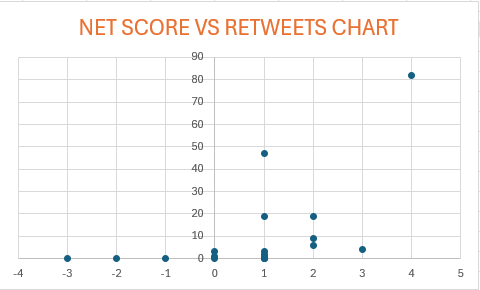

# Twitter-sentiment-analysis
Twitter Sentiment Analysis project built with Python as part of the "Python functions, files, and dictionaries" course by University of Michigan to analyze tweet sentiment and track retweet engagementز

## Overview
This project analyzes synthetic Twitter data to evaluate sentiment scores (positive and negative word counts) and visualizes their correlation with retweet counts.

## Key Features
- **Data Processing:** Cleaned and parsed raw text and CSV datasets using Python.
- **Sentiment Analysis:** Calculated net sentiment scores based on positive and negative word reference lists.
- **Data Visualization:** Built scatter plots mapping Net Sentiment Scores against Retweet numbers.

## Technologies Used
- Python 3
- Data Structures (Dictionaries, Tuples, Lists)
- File Handling (CSV reading & writing)
